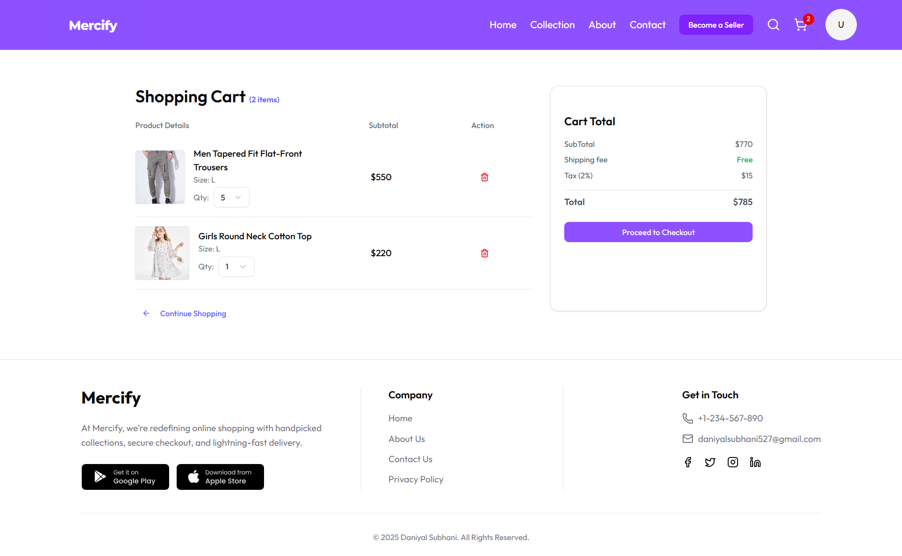
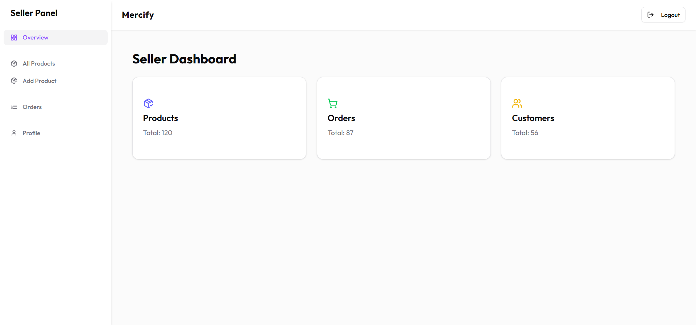
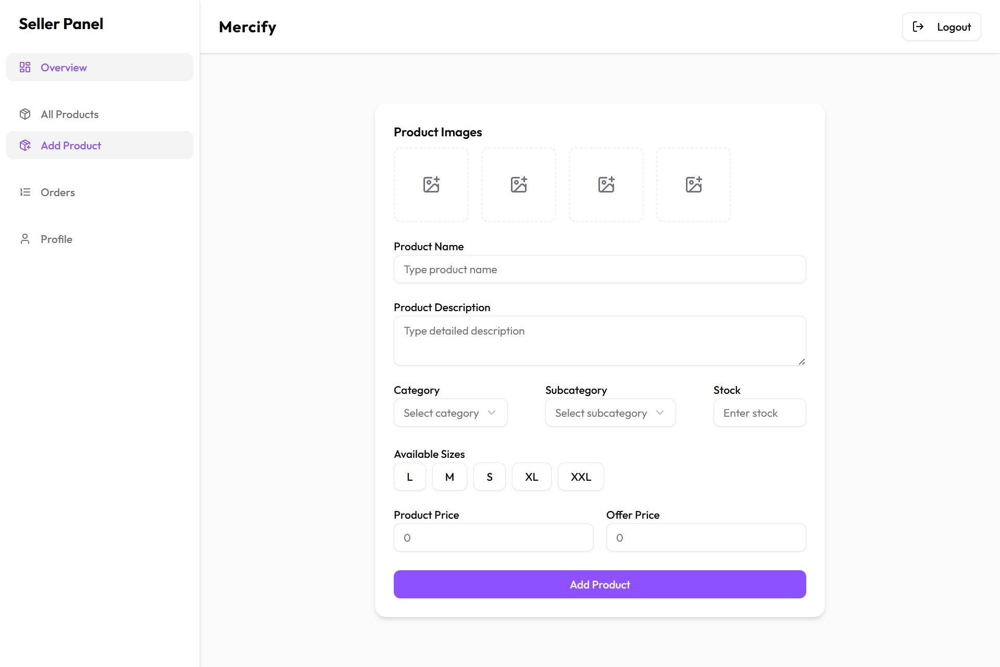

# 🛍️ Mercify — Full-Stack E-commerce Platform

Mercify is a production-grade, full-stack e-commerce application built entirely by me from scratch. It supports **multi-role functionality**: User, Seller, and Admin. The goal was to create a scalable and feature-rich application that mirrors real-world SaaS architecture.

---

## 🗣️ Important 
- This project is still in development. The current version is a **proof-of-concept** and not yet ready for production use. 
- Actually i upload frontend on vercel and backend on replit so thats why the server is not working sometimes. Replit server is not free so i can't keep it running all the time. Fetching data from Dataabase is not working properly. but i add screenshots of the project so you can see how it looks like. 
- Or just message me on +92 342 6435289 and i'll start the server for you. 
- I'll keep updating the project as i go along.
## 🔑 Roles & Features

### 👤 User

- Create account / login
- Browse products
- Add to cart
- Checkout and place orders
- View order history (in progress)
- Option to become a seller

### 🛒 Seller

- Register as seller
- Add, update, and delete products
- View own product listings
- View user and other seller profiles

### 🛠️ Admin(...soon)

- Full control over users and sellers
- Manage products globally
- View all user/seller profiles
- Future: analytics dashboards and insights

---

## 🚀 Tech Stack

### Frontend:

- React + Vite
- Tailwind CSS + Shadcn/UI + lucide icons
- Redux Toolkit + Persist
- React Hook Form + Zod
- React Router DOM

### Backend:

- Node.js + Express
- MongoDB (Mongo Compass for now, Mongo Atlas planned)
- JWT Authentication
- Multer + Cloudinary (for images)
- Role-based authorization
- Zod validation

---

## 📸 Screenshots

| Home Page                                | Seller Panel                    | Admin View                                  |
| ---------------------------------------- | ------------------------------- | ------------------------------------------- | -------------------------------------------- | --------------------------------------- | ----------------------------------- |
|  |  |  |  |  |  |  |  | 

---

## 🗂️ Project Structure

Mercify/
├── client/
│   ├── public/
│   └── src/
│       ├── assets/
│       ├── components/
│       ├── context/
│       ├── hooks/
│       ├── lib/
│       ├── pages/
│       ├── routes/
│       ├── schemas/
│       ├── store/
│       ├── helpers/
│       └── App.jsx
├── server/
│   ├── config/
│   ├── controllers/
│   ├── middlewares/
│   ├── models/
│   ├── routes/
│   ├── utils/
│   ├── validators/
│   └── server.js
├── .gitignore
├── README.md
└── package.json

---

## 🎯 What's Next

- connect to Stripe for payment processing
- Build Admin Dashboard , analytics, and insights
- Add analytics/graphs in admin dashboard
- Final testing & optimization
- Add more features and improvements

---

## 👨‍💻 Author

Made with 💻 by **Daniyal Subhani**

---

## 📬 Contact

If you're a recruiter or developer interested in this project, feel free to connect:

- GitHub: [Daniyal - Subhani](https://github.com/daniyal-subhani)
- Email: daniyalsubhani527@gmail.com
- LinkedIn: [Daniyal Subhani](https://www.linkedin.com/in/daniyal-subhani/)
